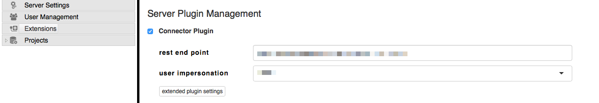

# Matrix Requirement Email integration
This is an example of using the Matrix Requirements API to integrate with your own systems. This basic example simply receives events and displays them on a web page.

## Requirements
Since the Matrix system needs a public URL to call with notifications, this example has to run on a publicly available system. To do this we install the service on [Heroku](http://www.heroku.com) which is an easy to use deployment platform for web applications.

Instead of running it on Heroku you can also run this example on any server that is accessible and can run node.js code. Simply clone this repository and run:
    
    npm install
    npm start

## Run it
The deployment is automated but before you need a (free) account at [Heroku](https://www.heroku.com). Before you press the button below make sure you create an account and login. Once the deployment has run through you can press the "View" link at the end of the deployment process.

## Configure your Matrix instance
Once your server is up and running you have to configure your Matrix instance to send change notifications to it. Go to the Administration of your system, select Extensions, add the REST endpoint of your system and select the user to use for the notifications. If you are unsure about the REST endpoint, open the page on Heroku which will show the URL in bold text.

Afterwards, click on "extended plugin settings" and configure the events that you want to forward. Below is an example with all possible events. You don't have to enable all of them.

    {
        "connections":[
            {
                "project":"SIMPLEST",
                "command":"item_created"
            },
            {
                "project":"SIMPLEST",
                "command":"item_edited"
            },
            {
                "project":"SIMPLEST",
                "command":"item_deleted"
            },
            {
                "project":"SIMPLEST",
                "command":"sign_created"
            },
            {
                "project":"SIMPLEST",
                "command":"sign_signed_partial"
            },
            {
                "project":"SIMPLEST",
                "command":"sign_signed_full"
            }
        ]
    }

## Make changes
If you want to play with the code but keep it running on Heroku follow these steps:

* Fork the Github repository to create your own copy
* Go to your Heroku instance
    * Click on Deploy
    * Under Deployment method, click on GitHub
    * If a GitHub confirmation dialog appears, approve access to your GitHub account
    * A Connect to GitHub section should appear
        - Select your GitHub account in the dropdown
        - Type in the name of your forked project (or leave empty)
        - Press search
        - The GitHub project should appear in the list below, press the Connect button next to it
    * If you want your instance to update every time you checkin changes then press the Enable Automatic Deploys button
    * If you would rather deploy manually then use the "Deploy Branch" button

Once this is set up you can clone your new GitHub repository, make changes to it and see your online app update every time you push the changes back to GitHub.

Of course you can also make use of the regular Heroku workflows as described in the [Node.js Instructions](https://devcenter.heroku.com/articles/getting-started-with-nodejs)
